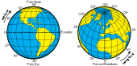
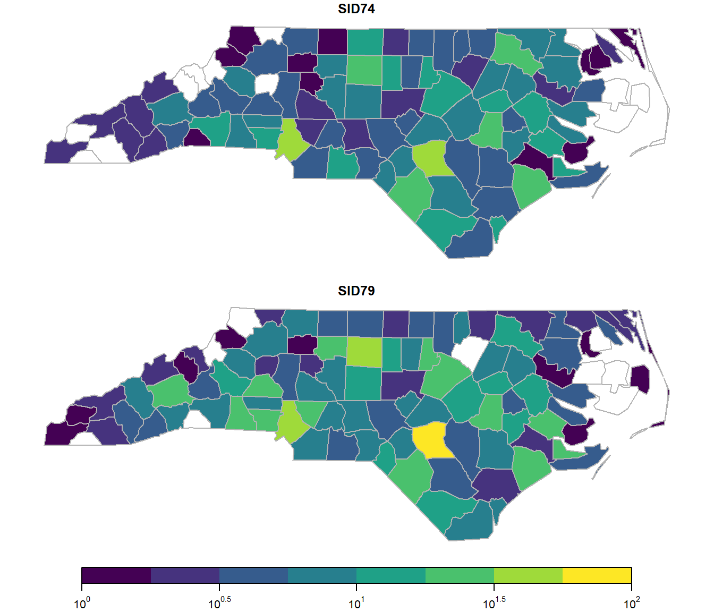
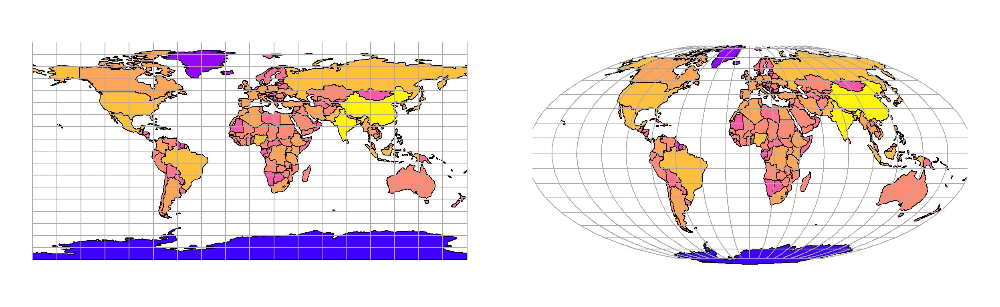
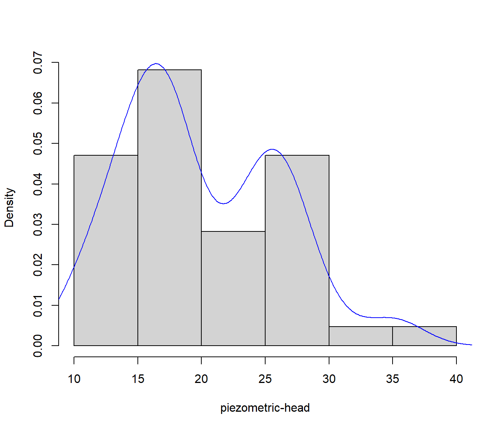
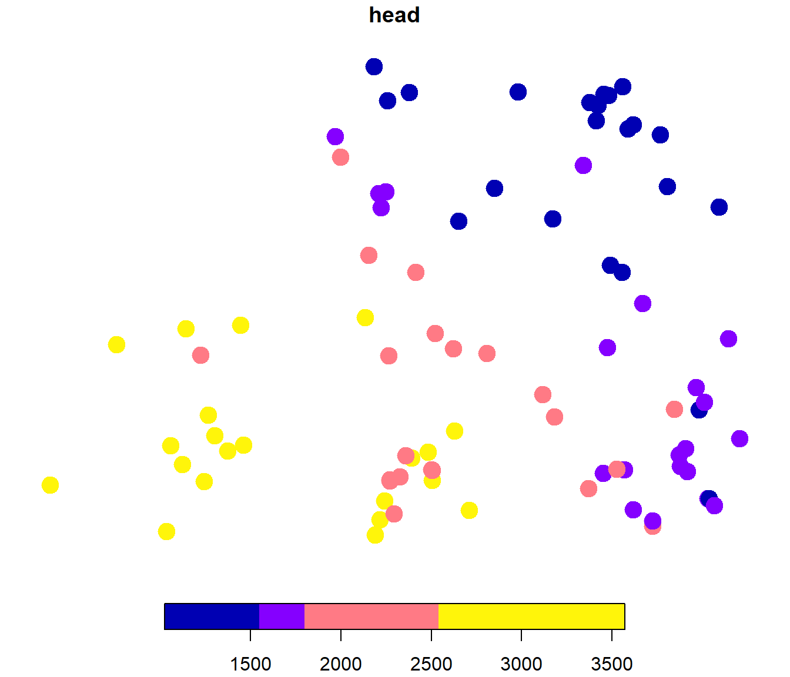
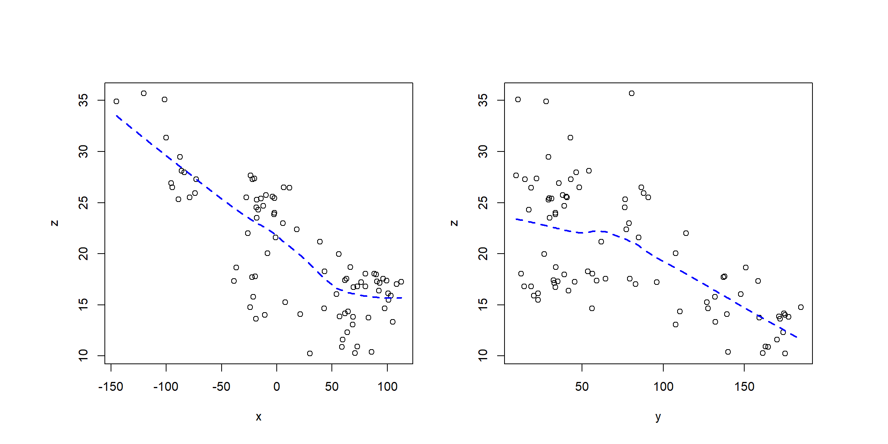

# Datos espaciales {#datos}

<!-- 
---
title: "Estadística Espacial"
author: "Análisis estadístico de datos con dependencia (GCED)"
date: "Curso 2021/2022"
bibliography: ["packages.bib", "estadistica_espacial.bib"]
link-citations: yes
output: 
  bookdown::html_document2:
    pandoc_args: ["--number-offset", "1,0"]
    toc: yes 
    # mathjax: local            # copia local de MathJax, hay que establecer:
    # self_contained: false     # las dependencias se guardan en ficheros externos 
  bookdown::pdf_document2:
    keep_tex: yes
    toc: yes 
---
Capítulo \@ref(datos)
bookdown::preview_chapter("02-datos.Rmd")
knitr::purl("02-datos.Rmd", documentation = 2)
knitr::spin("02-datos.R",knit = FALSE)
-->


En este capítulo se incluye una breve introducción a los tipos de datos espaciales (Sección \@ref(datos-tipos)) y a su manipulación en R con el paquete `sf` (secciones \@ref(sf-intro) y \@ref(operaciones-datos)).
La parte final se centra en el análisis exploratorio de datos espaciales (Sección \@ref(sp-eda)).

## Tipos de datos espaciales {#datos-tipos}


En el campo de los datos espaciales se suele distinguir entre dos tipos de datos:

-   *Datos vectoriales*: en los que se emplean coordenadas para definir las posiciones espaciales "exactas" de los datos. Entre ellos estarían los asociados a las geometrías habituales: puntos, líneas, polígonos y rejillas.

-   *Datos ráster*: se utilizan habitualmente para representar una superficie continua. Un ráster no es más que una rejilla regular que determina un conjunto de rectángulos denominados celdas (o píxeles en el análisis de imágenes de satélite y teledetección) que tienen asociados uno o más valores. Este tipo de datos también se denominan *arrays* o *data cubes* espaciales (o espacio-temporales). El valor de una celda ráster suele ser el valor medio (o el total) de una variable en el área que representa (se trataría de observaciones de un proceso agregado, descritos en la Sección \@ref(procesos-agregados)), aunque en algunos casos es el valor puntual correspondiente al centro de la celda (nodo de una rejilla vectorial). 

En este libro entenderemos que *ráster* hace referencia a agregaciones espaciales y nos centraremos principalmente en datos vectoriales (incluyendo rejillas de datos), aunque hoy en día cada vez es más habitual disponer de datos ráster gracias a la fotografía aérea y a la teledetección por satélite.
Como se comentó en la Sección \@ref(procesos-agregados), muchos métodos geoestadísticos admiten datos en distintos soportes (por ejemplo el *block kriging* descrito en la Sección 4.X), aunque combinar datos en diferentes soportes puede presentar en la práctica serias dificultades (para más detalles ver referencias al final de la Sección \@ref(procesos-agregados)).


Como ya se comentó en la Sección \@ref(proc-esp), dependiendo de las suposiciones sobre el soporte del proceso (índice espacial) se distingue entre distintos tipos de procesos espaciales.
Sin embargo, aunque en principio los objetivos pueden ser muy distintos, en todos estos casos se trabaja con datos similares (espaciales y espacio-temporales):

-   **Procesos geoestadísticos** (índice espacial continuo):

    -   *Datos*: coordenadas y valores observados (puntos y datos), opcionalmente se pueden considerar los límites de una región de observación o de múltiples regiones (polígonos).

    -   *Resultados*: superficie de predicción (rejilla),
        opcionalmente predicciones por área (polígonos y datos, o raster).

-   **Procesos reticulares/regionales** (índice espacial discreto):

    -   *Datos*: límites de regiones y valores asociados (polígonos y datos, , o raster).

    -   *Resultados*: estimaciones por área (polígonos y datos, o raster).

-   **Procesos puntuales** (indice espacial aleatorio):

    -   *Datos*: coordenadas (puntos), opcionalmente con valores asociados (procesos marcados; puntos y datos),
        límites región de observación (polígonos).

    -   *Resultados*: superficie de incidencia o probabilidad (rejilla).
        

Este es el principal motivo de que se hayan desarrollado paquetes de R para facilitar su manipulación (y permitiendo el intercambio de datos entre herramientas).
Entre ellos destacan:

-   [`sp`](https://CRAN.R-project.org/package=sp) [Classes and methods for spatial data, @Pebesma2005]: se corresponde con @Bivand2013 y emplea clases S4. Se complementa con los paquetes [`rgdal`](https://CRAN.R-project.org/package=rgdal) (interfaz a la *geospatial data abstraction library*, para la lectura y escritura de datos espaciales) y [`rgeos`](https://CRAN.R-project.org/package=rgeos) (interfaz a la librería *Geometry Engine Open Source*, para operaciones geométricas).

-   [`sf`](https://r-spatial.github.io/sf) [Simple Features for R, @Pebesma2018]: alternativa en desarrollo con objetos más simples S3 (compatible con [`tidyverse`](http://tidyverse.org) y que proporciona una interfaz directa a las librerías [GDAL](https://gdal.org) y [GEOS](https://trac.osgeo.org/geos)) que aspira a reemplazar el paquete `sp` a corto plazo. Se corresponde con @Pebesma2021 (disponible [online](https://keen-swartz-3146c4.netlify.app)).

El paquete `sp` tiene un soporte limitado para datos ráster, este es uno de los motivos por los que surgió el paquete [`raster`](https://CRAN.R-project.org/package=raster), que actualmente está siendo reemplazado por el paquete [`terra`](https://CRAN.R-project.org/package=terra) (información sobre estos paquetes está disponible en el [manual online](https://rspatial.org/)). 
El paquete `sf` no implementa datos ráster (y tiene un soporte muy limitado para rejillas de datos), para manejar este tipo de datos se complementa con el paquete [`starts`](https://r-spatial.github.io/stars) (Spatiotemporal Arrays: Raster and Vector Datacubes).
Para detalles sobre la conversión entre datos ráster y datos vectoriales ver por ejemplo las secciones [7.5](https://keen-swartz-3146c4.netlify.app/sf.html#raster-to-vector) y [7.7](https://keen-swartz-3146c4.netlify.app/sf.html#warp) de @Pebesma2021.

En este capítulo emplearemos el paquete `sf` <!--y puntualmente el paquete `stars` --> para la manipulación de datos espaciales, aunque en el Apéndice \@ref(intro-sp) se incluye una breve introducción a las clases `sp`, ya que este tipo de objetos siguen siendo ampliamente empleados en la actualidad (y, de momento, algunas de las herramientas disponibles en R solo admiten las clases de datos definidas en este paquete).

<!-- 
Pendiente:
Añadir referencias información adicional 
OSGeo [Open Source Geospatial Foundation](http://www.osgeo.org) open-source GIS software
Otros paquetes: rasterVis 

También están disponibles numerosos recursos en Internet. 
Por ejemplo para interactuar con ArcGis/ArcMap:

-   [R-ArcGIS Community](https://r-arcgis.github.io)  
-   https://www.seascapemodels.org/data/ArcGIS_to_R_Spatial_CheatSheet.pdf
-->


## Introducción al paquete **sf** {#sf-intro}

El modelo de geometrías de *[características simples](https://en.wikipedia.org/wiki/Simple_Features)* (o rasgos simples) es un estándar ([ISO 19125](https://www.iso.org/standard/40114.html)) desarrollado por el [Open Geospatial Consortium](https://www.ogc.org) (OGC) para formas geográficas vectoriales, que ha sido adoptado por gran cantidad de software geográfico (entre otros por GeoJSON, ArcGIS, QGIS, PostGIS, MySQL Spatial Extensions, Microsoft SQL Server...).
Como ya se comentó, este tipo de datos espaciales está implementado en R en el paquete [`sf`](https://r-spatial.github.io/sf).

Los objetos principales, del tipo `sf`, son extensiones de `data.frame` (o `tibble`) y como mínimo contienen una columna denominada *simple feature geometry list column* que contiene la geometría de cada observación (se trata de una columna tipo `list`). 
Cada fila, incluyendo la geometría y otras posibles variables (denominados atributos de la geometría), se considera una característica simple (SF).


```r
library(sf)
```

```
## Linking to GEOS 3.9.1, GDAL 3.2.1, PROJ 7.2.1
```

```r
nc <- st_read(system.file("shape/nc.shp", package="sf"), quiet = TRUE)
nc <- nc[c(5, 9:15)]
nc
```

```
## Simple feature collection with 100 features and 7 fields
## Geometry type: MULTIPOLYGON
## Dimension:     XY
## Bounding box:  xmin: -84.32385 ymin: 33.88199 xmax: -75.45698 ymax: 36.58965
## Geodetic CRS:  NAD27
## First 10 features:
##           NAME BIR74 SID74 NWBIR74 BIR79 SID79 NWBIR79
## 1         Ashe  1091     1      10  1364     0      19
## 2    Alleghany   487     0      10   542     3      12
## 3        Surry  3188     5     208  3616     6     260
## 4    Currituck   508     1     123   830     2     145
## 5  Northampton  1421     9    1066  1606     3    1197
## 6     Hertford  1452     7     954  1838     5    1237
## 7       Camden   286     0     115   350     2     139
## 8        Gates   420     0     254   594     2     371
## 9       Warren   968     4     748  1190     2     844
## 10      Stokes  1612     1     160  2038     5     176
##                          geometry
## 1  MULTIPOLYGON (((-81.47276 3...
## 2  MULTIPOLYGON (((-81.23989 3...
## 3  MULTIPOLYGON (((-80.45634 3...
## 4  MULTIPOLYGON (((-76.00897 3...
## 5  MULTIPOLYGON (((-77.21767 3...
## 6  MULTIPOLYGON (((-76.74506 3...
## 7  MULTIPOLYGON (((-76.00897 3...
## 8  MULTIPOLYGON (((-76.56251 3...
## 9  MULTIPOLYGON (((-78.30876 3...
## 10 MULTIPOLYGON (((-80.02567 3...
```

```r
str(nc)
```

```
## Classes 'sf' and 'data.frame':	100 obs. of  8 variables:
##  $ NAME    : chr  "Ashe" "Alleghany" "Surry" "Currituck" ...
##  $ BIR74   : num  1091 487 3188 508 1421 ...
##  $ SID74   : num  1 0 5 1 9 7 0 0 4 1 ...
##  $ NWBIR74 : num  10 10 208 123 1066 ...
##  $ BIR79   : num  1364 542 3616 830 1606 ...
##  $ SID79   : num  0 3 6 2 3 5 2 2 2 5 ...
##  $ NWBIR79 : num  19 12 260 145 1197 ...
##  $ geometry:sfc_MULTIPOLYGON of length 100; first list element: List of 1
##   ..$ :List of 1
##   .. ..$ : num [1:27, 1:2] -81.5 -81.5 -81.6 -81.6 -81.7 ...
##   ..- attr(*, "class")= chr [1:3] "XY" "MULTIPOLYGON" "sfg"
##  - attr(*, "sf_column")= chr "geometry"
##  - attr(*, "agr")= Factor w/ 3 levels "constant","aggregate",..: NA NA NA NA NA NA NA
##   ..- attr(*, "names")= chr [1:7] "NAME" "BIR74" "SID74" "NWBIR74" ...
```

El nombre de la columna de geometrías está almacenado en el atributo `"sf_column"` del objeto y se puede acceder a ella mediante la función `st_geometry()` (además de poder emplear los procedimientos habituales para acceder a los componentes de un `data.frame`).
Esta columna es un objeto de tipo `sfc` (*simple feature geometry list column*), descritos más adelante.


```r
# geom_name <- attr(nc, "sf_column")
# nc[, geom_name]; nc[[geom_name]]
# nc$geometry
st_geometry(nc)
```

```
## Geometry set for 100 features 
## Geometry type: MULTIPOLYGON
## Dimension:     XY
## Bounding box:  xmin: -84.32385 ymin: 33.88199 xmax: -75.45698 ymax: 36.58965
## Geodetic CRS:  NAD27
## First 5 geometries:
```

```
## MULTIPOLYGON (((-81.47276 36.23436, -81.54084 3...
```

```
## MULTIPOLYGON (((-81.23989 36.36536, -81.24069 3...
```

```
## MULTIPOLYGON (((-80.45634 36.24256, -80.47639 3...
```

```
## MULTIPOLYGON (((-76.00897 36.3196, -76.01735 36...
```

```
## MULTIPOLYGON (((-77.21767 36.24098, -77.23461 3...
```

En este paquete, todos los métodos y funciones que operan sobre datos espaciales comienzan por `st_` (*spatial type*; siguiendo la implementación de PostGIS):


```r
methods(class="sf")
```

```
##  [1] $<-                   [                     [[<-                 
##  [4] aggregate             as.data.frame         cbind                
##  [7] coerce                dbDataType            dbWriteTable         
## [10] filter                identify              initialize           
## [13] merge                 plot                  print                
## [16] rbind                 show                  slotsFromS3          
## [19] st_agr                st_agr<-              st_area              
## [22] st_as_s2              st_as_sf              st_bbox              
## [25] st_boundary           st_buffer             st_cast              
## [28] st_centroid           st_collection_extract st_convex_hull       
## [31] st_coordinates        st_crop               st_crs               
## [34] st_crs<-              st_difference         st_filter            
## [37] st_geometry           st_geometry<-         st_inscribed_circle  
## [40] st_interpolate_aw     st_intersection       st_intersects        
## [43] st_is                 st_is_valid           st_join              
## [46] st_line_merge         st_m_range            st_make_valid        
## [49] st_nearest_points     st_node               st_normalize         
## [52] st_point_on_surface   st_polygonize         st_precision         
## [55] st_reverse            st_sample             st_segmentize        
## [58] st_set_precision      st_shift_longitude    st_simplify          
## [61] st_snap               st_sym_difference     st_transform         
## [64] st_triangulate        st_union              st_voronoi           
## [67] st_wrap_dateline      st_write              st_z_range           
## [70] st_zm                 transform            
## see '?methods' for accessing help and source code
```

Los objetos geométricos básicos son del tipo `sfg` (*simple feature geometry*) que contienen la geometría de una única característica definida a partir de puntos en dos (XY), tres (XYZ, XYM) o cuatro dimensiones (XYZM).
Admite los 17 tipos de geometrías simples del estándar, pero de forma completa los 7 tipos básicos:

| Tipo             | Description                                        | Creación        |
| ---------------- | -------------------------------------------------- | ---------------- |
| `POINT`, `MULTIPOINT` | Punto o conjunto de puntos | `st_point()`, `st_multipoint()` |
| `LINESTRING`, `MULTILINESTRING` | Línea o conjunto de líneas | `st_linestring()`, `st_multilinestring()` |
| `POLYGON`, `MULTIPOLYGON` | Polígono^[Secuencia de puntos que forma un anillo cerrado, que no se interseca; el primero anillo definen el anillo exterior, anillos posteriores definen agujeros. Según la norma, los puntos del anillo exterior deben especificarse en sentido contrario a las agujas del reloj y los de los agujeros en sentido de las agujas del reloj.] o conjunto de polígonos | `st_polygon()`, `st_multipolygon()` |
| `GEOMETRYCOLLECTION` | Conjunto de geometrías de los tipos anteriores | `st_geometrycollection()` |

Las geometrías se imprimen empleando la representación *well-known text* (WKT) del estándar (se exportan empleando la representación *well-known binary*, WKB).


```r
nc$geometry[[1]]
```

```
## MULTIPOLYGON (((-81.47276 36.23436, -81.54084 36.27251, -81.56198 36.27359, -81.63306 36.34069, -81.74107 36.39178, -81.69828 36.47178, -81.7028 36.51934, -81.67 36.58965, -81.3453 36.57286, -81.34754 36.53791, -81.32478 36.51368, -81.31332 36.4807, -81.26624 36.43721, -81.26284 36.40504, -81.24069 36.37942, -81.23989 36.36536, -81.26424 36.35241, -81.32899 36.3635, -81.36137 36.35316, -81.36569 36.33905, -81.35413 36.29972, -81.36745 36.2787, -81.40639 36.28505, -81.41233 36.26729, -81.43104 36.26072, -81.45289 36.23959, -81.47276 36.23436)))
```

Los objetos básicos `sfg` (normalmente del mismo tipo) se pueden combinar en un objeto `sfc` (*simple feature geometry list column*) mediante la función `st_sfg()`.
Estos objetos pueden incorporar un sistema de referencia de coordenadas (por defecto `NA_crs_`), descritos en la Sección \@ref(crs).
Posteriormente se puede crear un objeto `sf` mediante la función `st_sf()`.


```r
p1 <- st_point(c(-8.395835, 43.37087))
p2 <- st_point(c(-7.555851, 43.01208))
p3 <- st_point(c(-7.864641, 42.34001))
p4 <- st_point(c(-8.648053, 42.43362))
sfc <- st_sfc(list(p1, p2, p3, p4))
cprov <- st_sf(names = c('Coruña (A)', 'Lugo', 'Ourense', 'Pontevedra'),
    geom = sfc)
cprov
```

```
## Simple feature collection with 4 features and 1 field
## Geometry type: POINT
## Dimension:     XY
## Bounding box:  xmin: -8.648053 ymin: 42.34001 xmax: -7.555851 ymax: 43.37087
## CRS:           NA
##        names                       geom
## 1 Coruña (A) POINT (-8.395835 43.37087)
## 2       Lugo POINT (-7.555851 43.01208)
## 3    Ourense POINT (-7.864641 42.34001)
## 4 Pontevedra POINT (-8.648053 42.43362)
```

Esta forma de proceder puede resultar de interés cuando se construyen geometrías tipo líneas o polígonos, pero en el caso de datos puntuales (las observaciones habituales en geoestadística), resulta mucho más cómodo emplear un `data.frame` que incluya las coordenadas en columnas y convertirlo a un objeto `sf` mediante la función `st_as_sf()`.

---

\BeginKnitrBlock{exercise}\iffalse{-91-67-114-101-97-99-105-243-110-32-100-101-32-117-110-97-32-99-111-108-117-109-110-97-32-100-101-32-103-101-111-109-101-116-114-237-97-115-93-}\fi{}<div class="exercise"><span class="exercise" id="exr:sfc"><strong>(\#exr:sfc)  \iffalse (Creación de una columna de geometrías) \fi{} </strong></span>Crear una geometría (un objeto `sfc`) formada por: dos puntos en las posiciones 
(1,5) y (5,5), una línea entre los puntos (1,1) y (5,1), y un polígono, con vértices 
{(0,0), (6,0), (6,6), (0,6), (0,0)} y con un agujero con vértices {(2,2), (2,4), 
(4,4), (4,2), (2,2)} (NOTA: consultar la ayuda `?st`, puede resultar cómodo emplear 
`matrix(... , ncol = 2, byrow = TRUE)`).
</div>\EndKnitrBlock{exercise}
<!-- \@ref(exr:sfc) -->

---

Como ejemplo consideraremos el conjunto de datos `meuse` del paquete `sp` que contiene concentraciones de metales pesados, junto con otras variables del terreno, en una zona de inundación del río Meuse (cerca de Stein, Holanda)^[Empleado en la [viñeta](https://cran.r-project.org/web/packages/gstat/vignettes/gstat.pdf) del paquete `gstat` con el paquete `sp`.] (ver Figura \@ref(fig:meuse-sf)).


```r
data(meuse, package="sp")
str(meuse)
```

```
## 'data.frame':	155 obs. of  14 variables:
##  $ x      : num  181072 181025 181165 181298 181307 ...
##  $ y      : num  333611 333558 333537 333484 333330 ...
##  $ cadmium: num  11.7 8.6 6.5 2.6 2.8 3 3.2 2.8 2.4 1.6 ...
##  $ copper : num  85 81 68 81 48 61 31 29 37 24 ...
##  $ lead   : num  299 277 199 116 117 137 132 150 133 80 ...
##  $ zinc   : num  1022 1141 640 257 269 ...
##  $ elev   : num  7.91 6.98 7.8 7.66 7.48 ...
##  $ dist   : num  0.00136 0.01222 0.10303 0.19009 0.27709 ...
##  $ om     : num  13.6 14 13 8 8.7 7.8 9.2 9.5 10.6 6.3 ...
##  $ ffreq  : Factor w/ 3 levels "1","2","3": 1 1 1 1 1 1 1 1 1 1 ...
##  $ soil   : Factor w/ 3 levels "1","2","3": 1 1 1 2 2 2 2 1 1 2 ...
##  $ lime   : Factor w/ 2 levels "0","1": 2 2 2 1 1 1 1 1 1 1 ...
##  $ landuse: Factor w/ 15 levels "Aa","Ab","Ag",..: 4 4 4 11 4 11 4 2 2 15 ...
##  $ dist.m : num  50 30 150 270 380 470 240 120 240 420 ...
```

```r
# ?meuse 
# Sistema de coordenadas Rijksdriehoek (RDH) (Netherlands topographical) 
# https://epsg.io/28992 # EPSG:28992
meuse_sf <- st_as_sf(meuse, coords = c("x", "y"), crs = 28992, agr = "constant")

# Rio Meuse 
data(meuse.riv, package="sp")
str(meuse.riv)
```

```
##  num [1:176, 1:2] 182004 182137 182252 182315 182332 ...
```

```r
meuse_riv <- st_sfc(st_polygon(list(meuse.riv)), crs = 28992)

# Rejilla
data(meuse.grid, package="sp")
str(meuse.grid)
```

```
## 'data.frame':	3103 obs. of  7 variables:
##  $ x     : num  181180 181140 181180 181220 181100 ...
##  $ y     : num  333740 333700 333700 333700 333660 ...
##  $ part.a: num  1 1 1 1 1 1 1 1 1 1 ...
##  $ part.b: num  0 0 0 0 0 0 0 0 0 0 ...
##  $ dist  : num  0 0 0.0122 0.0435 0 ...
##  $ soil  : Factor w/ 3 levels "1","2","3": 1 1 1 1 1 1 1 1 1 1 ...
##  $ ffreq : Factor w/ 3 levels "1","2","3": 1 1 1 1 1 1 1 1 1 1 ...
```

```r
meuse_grid <- st_as_sf(meuse.grid, coords = c("x", "y"), 
                       crs = 28992, agr = "constant")
# Almacenar
# save(meuse_sf, meuse_riv, meuse_grid, file = "datos/st_meuse.RData")

# Representar
plot(meuse_sf["zinc"], pch = 16, cex = 1.5, main = "",
     breaks = "quantile", key.pos = 4, reset = FALSE)
plot(meuse_riv, col = "lightblue", add = TRUE)
plot(st_geometry(meuse_grid), pch = 3, cex = 0.2, col = "lightgray", add = TRUE)
```

<div class="figure" style="text-align: center">

<p class="caption">(\#fig:meuse-sf)Concentración de zinc (ppm) en el entorno del río Meuse (datos `sp::meuse`).</p>
</div>

---

\BeginKnitrBlock{exercise}\iffalse{-91-67-114-101-97-99-105-243-110-32-121-32-114-101-112-114-101-115-101-110-116-97-99-105-243-110-32-100-101-32-100-97-116-111-115-32-101-115-112-97-99-105-97-108-101-115-93-}\fi{}<div class="exercise"><span class="exercise" id="exr:aquifer1"><strong>(\#exr:aquifer1)  \iffalse (Creación y representación de datos espaciales) \fi{} </strong></span>Cargar los datos del acuífero Wolfcamp (*aquifer.RData*), generar el correspondiente
objeto `sf` y representarlo mostrando los ejes.
</div>\EndKnitrBlock{exercise}
<!-- \@ref(exr:aquifer1) -->

---

### Sistemas de referencia de coordenadas {#crs}

El sistema de referencia de coordenadas (CRS) especifica la correspondencia entre valores de las coordenadas y puntos concretos en la superficie de la Tierra (o del espacio), y resulta fundamental cuando se combinan datos espaciales.
En general se consideran dos tipos de CRS:

- Geodésico: las coordenadas en tres dimensiones (latitud, longitud y altura) se basan en un elipsoide de referencia (global o local) que sirve como aproximación del globo terrestre (se tiene en cuenta que no es una esfera perfecta e incluso que puede haber variaciones locales). Este elipsoide, junto con información adicional sobre como interpretar las coordenadas (incluyendo el orden y el origen), define el denominado *datum*. Normalmente se asume que las coordenadas son en la superficie terrestre y solo se consideran:

    - latitud: ángulo entre el plano ecuatorial y la línea que une la posición con el centro de la Tierra. Varía desde -90 (polo sur) hasta 90 (polo norte). Un grado equivale aproximadamente a 110.6 km. Los paralelos son las líneas en la superficie terrestre correspondientes a la misma latitud (siendo el 0 el ecuador).
    - longitud: ángulo (paralelo al plano ecuatorial) entre un meridiano de referencia (arco máximo que une los polos pasando por una determinado punto, normalmente el observatorio de Greenwich) y la línea que une la posición con el centro de la Tierra. Varía desde -180 (oeste) hasta 180 (este). Un grado en el ecuador equivale a aproximadamente a 111.3 km. Los meridianos son las líneas en la superficie terrestre correspondientes a la misma longitud (siendo el 0 el meridiano de Greenwich y -180 o 180 el correspondiente antimeridiano).
    
    La rejilla correspondiente a un conjunto de paralelos y meridianos se denomina *gratícula* (ver `st_graticule()`).
    
    <div class="figure" style="text-align: center">
    
    <p class="caption">(\#fig:latlon)Coordenadas geográficas en la superficie terrestre (Fuente Wikimedia Commons).</p>
    </div>
<!-- 
[Wikimedia Commons](https://commons.wikimedia.org/wiki/File:Latitud_y_Longitud_en_la_Tierra.svg) 
https://upload.wikimedia.org/wikipedia/commons/5/58/Latitud_y_Longitud_en_la_Tierra.svg
-->
 
    Uno de los CRS más empleados es el WGS84 (*World Geodetic System 1984*) en el que se basa el *Sistema de Posicionamiento Global* (GPS). 
    
- Proyectado (cartesiano): sistema (local) en dos dimensiones que facilita algún tipo de cálculo (normalmente distancias o áreas). Por ejemplo el UTM (*Universal Transverse Mercator*), que emplea coordenadas en metros respecto a una cuadrícula de referencia (se divide la tierra en 60 husos de longitud, numerados, y 20 bandas de latitud, etiquetadas con letras; por ejemplo Galicia se encuentra en la cuadricula 29T). Se define relacionando estas coordenadas cartesianas con coordenadas geodésicas con un determinado datum. 

En `sf` se emplea la librería [PRØJ](http://proj.org/) para definir el CRS y convertir coordenadas en distintos sistemas^[El paquete `sf` admite las últimas versiones PROJ 5 y 6, incluyendo el formato WKT-2 de 2019, mientras que el paquete `sp` está diseñado para cadenas de texto *PROJ.4* que se recomiendan abandonar (las últimas versiones permiten añadir una cadena WKT2 como `comment`).].
Para obtener o establecer el CRS se puede emplear la función `st_crs()`.
Se puede especificar mediante una cadena de texto que admita [GDAL](https://gdal.org/tutorials/osr_api_tut.html) (por ejemplo `"WGS84"`, que se corresponde con el *World Geodetic System 1984*), que típicamente es de la forma ESTÁNDAR:CÓDIGO (también puede ser una cadena de texto *PROJ.4*).
El estándar más empleado es el [EPSG](https://epsg.org) (*European Petroleum Survey Group*), y es que que da por hecho el paquete `sf` cuando se especifica el CRS mediante un número. 
También admite el estándar [OGC WKT](http://www.opengeospatial.org/standards/wkt-crs) (*Open Geospatial Consortium well-known text*) que es el que emplea internamente, pero resulta complicado manejar en la práctica.


```r
st_crs("WGS84")
```

```
## Coordinate Reference System:
##   User input: WGS84 
##   wkt:
## GEOGCRS["WGS 84",
##     DATUM["World Geodetic System 1984",
##         ELLIPSOID["WGS 84",6378137,298.257223563,
##             LENGTHUNIT["metre",1]]],
##     PRIMEM["Greenwich",0,
##         ANGLEUNIT["degree",0.0174532925199433]],
##     CS[ellipsoidal,2],
##         AXIS["geodetic latitude (Lat)",north,
##             ORDER[1],
##             ANGLEUNIT["degree",0.0174532925199433]],
##         AXIS["geodetic longitude (Lon)",east,
##             ORDER[2],
##             ANGLEUNIT["degree",0.0174532925199433]],
##     ID["EPSG",4326]]
```

```r
all.equal(st_crs(4326), st_crs("EPSG:4326"), st_crs("WGS84"))
```

```
## [1] TRUE
```

```r
st_crs(nc)
```

```
## Coordinate Reference System:
##   User input: NAD27 
##   wkt:
## GEOGCRS["NAD27",
##     DATUM["North American Datum 1927",
##         ELLIPSOID["Clarke 1866",6378206.4,294.978698213898,
##             LENGTHUNIT["metre",1]]],
##     PRIMEM["Greenwich",0,
##         ANGLEUNIT["degree",0.0174532925199433]],
##     CS[ellipsoidal,2],
##         AXIS["latitude",north,
##             ORDER[1],
##             ANGLEUNIT["degree",0.0174532925199433]],
##         AXIS["longitude",east,
##             ORDER[2],
##             ANGLEUNIT["degree",0.0174532925199433]],
##     ID["EPSG",4267]]
```

En [spatialreference.org](https://spatialreference.org) se puede obtener información detallada sobre una gran cantidad de proyecciones (y permite realizar búsquedas).
También puede ser de utilidad [epsg.io](https://epsg.io) o este [listado](https://proj.org/operations/projections) con detalles de los parámetros.

El CRS ideal dependerá del tipo de problema y de la zona cubierta por los datos (ver e.g Lovelace et al, 2021, [Sección 6.3](https://geocompr.robinlovelace.net/reproj-geo-data.html#which-crs-to-use), para más información).
En general en estadística espacial nos interesará trabajar con coordenadas proyectadas, de forma que tenga sentido emplear la distancia euclídea (algo que puede ser poco o nada razonable si se trabaja con coordenadas geodésicas en una zona muy amplia del globo o cerca de los polos).
En el caso de coordenadas sin proyectar (latitud/longitud) puede ser preferible trabajar con distancias ortodrómicas (longitud del arco del círculo máximo que une los puntos, *great circle distances*)^[Algo que ya hace de forma automática el paquete `gstat`.].
Es importante destacar que cambiar el CRS no reproyecta los datos, hay que emplear `st_transform()` para hacerlo, como se describe en la Sección \@ref(operaciones-datos).

Finalmente hay que insistir también en que el campo de aplicación de la estadística espacial no se restringe al análisis de datos geográficos (por ejemplo nos puede interesar analizar el desgaste en la pared de un crisol empleado en fundición) y en estos casos los CRS geográficos carecen de sentido.
De todos modos habrá que emplear un sistema de coordenadas que permita calcular algún tipo de salto o distancia entre puntos (aunque siempre se pueden considerar coordenadas espaciales tres dimensiones con la distancia euclídea).


### Integración con el ecosistema **tidyverse** {#tidyverse-sf}

El paquete `sf` es compatible con [`tidyverse`](http://tidyverse.org) y proporciona métodos para interactuar con los paquetes [`dplyr`](https://dplyr.tidyverse.org), 
[`tidyr`](http://tidyr.tidyverse.org) y [`ggplot2`](https://ggplot2.tidyverse.org).

Algunos de los métodos de interés para manipular datos espaciales con el paquete [`dplyr`](https://dplyr.tidyverse.org) son:

* `filter()`, `select()`, `mutate()`, `summarise(..., do_union = TRUE, is_coverage = FALSE)`, `group_by()`, `ungroup()`, etc.
* `inner_join()`, `left_join()`, `right_join()`, `full_join()`, `semi_join()`, `anti_join()`, `st_join()`.
* `st_drop_geometry()`, `st_set_crs()`.

Para detalles ver la [referencia](https://r-spatial.github.io/sf/reference/tidyverse.html).

<!-- , `rowwise()`,  `transmute()`, `rename()`, `arrange()`, `slice()`,  `distinct()`, `gather()`, `spread()`, `sample_n()`, `sample_frac()`, `nest()`, `separate()`, `separate_rows()`, `unite()`, `unnest()`,  -->

En el caso del paquete [`ggplot2`](https://ggplot2.tidyverse.org) se puede consultar la [referencia](https://ggplot2.tidyverse.org/reference/ggsf.html) y el tutorial *Drawing beautiful maps programmatically with R, sf and ggplot2*:

* [Part 1: Basics (General concepts illustrated with the world Map)](https://r-spatial.org/r/2018/10/25/ggplot2-sf.html).
* [Part 2: Layers (Adding additional layers: an example with points and polygons)](https://r-spatial.org/r/2018/10/25/ggplot2-sf-2.html).
* [Part 3: Layouts (Positioning and layout for complex maps)](https://r-spatial.org/r/2018/10/25/ggplot2-sf-3.html).

Por ejemplo, se puede generar un gráfico similar al de la Figura \@ref(fig:mortalidad) (porcentaje de incremento de las defunciones en el año 2020 respecto al 2019 en las CCAA españolas; datos provisionales [INE](https://www.ine.es/jaxi/Tabla.htm?tpx=21856&L=0)), con el siguiente código:


```r
library(dplyr)
library(mapSpain) 
mortalidad <- read.csv2("datos/mortalidad.csv")
CCAA_sf <- esp_get_ccaa() %>% left_join(mortalidad) %>%
  mutate(incremento = 100*(mort.2020 - mort.2019)/mort.2019)

library(ggplot2)
ggplot(CCAA_sf) +
  geom_sf(aes(fill = incremento), color = "grey70") +
  scale_fill_gradientn(colors = hcl.colors(10, "Blues", rev = TRUE)) +
  geom_sf_label(aes(label = paste0(round(incremento, 1), "%")), alpha = 0.5) +
  geom_sf(data = esp_get_can_box(), color = "grey70") + 
  theme_void()
```

<div class="figure" style="text-align: center">

<p class="caption">(\#fig:dplyr-ggplot)Ejemplo de gráfico generado empleando los paquetes `dplyr` y `ggplot2`.</p>
</div>


Sin embargo, en este libro se supone que no se está familiarizado con estas herramientas y se evitará su uso (aunque pueden resultar más cómodas después de su aprendizaje).
Para una introducción a [`dplyr`](https://dplyr.tidyverse.org), ver por ejemplo la viñeta [Introduction to dplyr](https://cran.rstudio.com/web/packages/dplyr/vignettes/dplyr.html),
el [Capítulo 5](http://r4ds.had.co.nz/transform.html) del libro [R for Data Science](http://r4ds.had.co.nz) o el [Capítulo 4](https://gltaboada.github.io/tgdbook/dplyr.html) de los apuntes [Prácticas de Tecnologías de Gestión y Manipulación de Datos](https://gltaboada.github.io/tgdbook).

No obstante, en ciertas ocasiones emplearemos el operador *pipe* `%>%` (tubería, redirección) por comodidad.
Este operador permite canalizar la salida de una función a la entrada de otra.
Por ejemplo `segundo(primero(datos))` se traduce en `datos %>% primero %>% segundo`
(facilitando la lectura de expresiones de izquierda a derecha).


## Representación de datos espaciales

El paquete `sf` implementa métodos `plot()` para la representación de objetos espaciales (ver [`?plot.sf`](https://r-spatial.github.io/sf/reference/plot.html)). 
Estos métodos suelen ser la forma más rápida de generar gráficos básicos (estáticos), pero también se pueden emplear otros paquetes como [`ggplot2`](https://ggplot2.tidyverse.org) (Sección \@ref(tidyverse-sf)), [`tmap`](https://r-tmap.github.io/tmap), [`mapsf`](https://riatelab.github.io/mapsf), [`leaflet`](https://rstudio.github.io/leaflet), [`mapview`](https://r-spatial.github.io/mapview), [`mapdeck`](https://symbolixau.github.io/mapdeck) o [`ggmap`](https://github.com/dkahle/ggmap), para generar mapas más avanzados, incluyendo mapas dinámicos.
Para una introducción a las posibilidades gráficas con el paquete `sf` se puede consultar la viñeta [*Plotting Simple Features*](https://r-spatial.github.io/sf/articles/sf5.html).

El método `plot()` es de la forma:

```r
plot(x, ..., max.plot, pal = NULL, nbreaks, breaks = "pretty", 
     key.pos, key.length, key.width, extent = x, axes = FALSE, 
     graticule = NA_crs_, col_graticule = "grey", border, reset = TRUE)
```

* `x`: objeto de tipo `sf` o `sfc`.
* `max.plot`: número máximo de atributos que se representarán. 
* `pal`: función que genera la paleta de colores (ver e.g. `?rainbow`), por defecto `sf.colors` (ver Figura \@ref(fig:multi-plot-sf)).
* `nbreaks`: número de puntos de corte para la clave de color.
* `breaks`: vector de puntos de corte o cadena de texto válida para el argumento `style` de `classIntervals` (ver figuras: \@ref(fig:meuse-sf), \@ref(fig:multi-plot-sf)).
* `key.pos`: posición de la leyenda, -1 = automática, 0 = error?, 1 = abajo, 2 = izquierda, 3 = arriba, 4 = derecha, NULL = omitir. Cuando se representan múltiples atributos se añade una única leyenda común únicamente si se establece (ver figuras: \@ref(fig:multi-plot-sf), \@ref(fig:transform)).
* `key.length`, `key.width`: dimensiones de la leyenda (proporción de espacio).
* `extent`: objeto con método `st_bbox()` para definir los límites (sustituyendo a `xlim` e `ylim`).
* `axes`: lógico; `TRUE` para dibujar los ejes.
* `graticule`: lógico, objeto de clase `crs` (`st_crs()`) u objeto creado por `st_graticule`; `TRUE` representará la gratícula `st_graticule(x)` (ver Figura \@ref(fig:transform)).
* `col_graticule`: color de la gratícula.
* `border`: color de los bordes de polígonos.
* `reset`: lógico; si el gráfico contiene una leyenda se modifican los parámetros gráficos y por defecto los restaura (`reset = TRUE`). Solo en ese caso es necesario establecer `reset = FALSE` para continuar añadiendo elementos, con `add = TRUE` (para restaurarlos hay que ejecutar `dev.off()`) (ver figuras: \@ref(fig:meuse-sf), \@ref(fig:multi-plot-sf)). 
* `...`: otros parámetros gráficos (ver `?plot.default` y `?par`).

Ejemplo:

```r
library(viridis)
plot(nc[c("SID74", "SID79")], pal = viridis, border = 'grey70', logz = TRUE, 
     breaks = seq(0, 2, len = 9), at = c(0, 0.5, 1, 1.5, 2), 
     key.pos = 1, key.width = lcm(1.2), key.length = 0.8) 
```

<div class="figure" style="text-align: center">

<p class="caption">(\#fig:multi-plot-sf)Ejemplo de gráfico con múltiples atributos (con colores personalizados y leyenda común, en escala logarítmica personalizada).</p>
</div>

<!-- 
Pendiente:
Pintar centroides con cex variable?
https://geocompr.robinlovelace.net/spatial-class.html#base-args
-->

El paquete [`tmap`](https://r-tmap.github.io/tmap) permite generar mapas temáticos con una gramática similar a la de `ggplot2` pero enfocada a mapas.
Por defecto crea mapas estáticos (`tmap_mode("plot")`):


```r
library(tmap)
tm_shape(nc) + tm_polygons("SID79")
```

<div class="figure" style="text-align: center">

<p class="caption">(\#fig:tmap-plot)Ejemplo de mapa estático creado con `tmap`.</p>
</div>

Aunque puede crear mapas interactivos, en páginas html, utilizando el paquete [`leaflet`](https://rstudio.github.io/leaflet) (interfaz a la librería JavaScript [Leaflet ](https://leafletjs.com)), implementando también leyendas, ventanas emergentes al pulsar con el ratón en las características y soporte para datos rasterizados.


```r
tmap_mode("view")
tmap_last()
# Error en bookdown
```

Para más información ver el capítulo [Making maps with R](https://geocompr.robinlovelace.net/adv-map.html#adv-map) del libro [Geocomputation with R](https://geocompr.robinlovelace.net), la [viñeta](https://r-tmap.github.io/tmap/articles/tmap-getstarted.html) del paquete, o el borrador del libro [Elegant and informative maps with tmap](https://r-tmap.github.io). 


El paquete [`mapview`](https://r-spatial.github.io/mapview) también permite crear mapas interactivos utilizando el paquete [`leaflet`](https://rstudio.github.io/leaflet) (con funcionalidades añadidas) o el paquete [`mapdeck`](https://symbolixau.github.io/mapdeck) (diseñado para grandes conjuntos de datos espaciales).


```r
library(mapview)
mapview(nc, zcol = "SID79")
# Error en bookdown
```

Para más información ver las [viñetas](https://r-spatial.github.io/mapview/articles/articles/mapview_01-basics.html) del paquete.

<!-- 
PENDIENTE: tmap y mapview ERROR en bookdown:
Error: path for html_dependency not found
ERROR DE PANDOC?

[`tmap`](https://r-tmap.github.io/tmap) : mapas temáticos
[`mapview`](https://r-spatial.github.io/mapview): interfaz a leaflet y mapdeck
[`leaflet`](https://rstudio.github.io/leaflet) : mapas interactivos
[`mapdeck`](https://symbolixau.github.io/mapdeck) : mapas interactivos para grandes conjuntos de datos
[`ggmap`](https://github.com/dkahle/ggmap) : inclusión de mapas base (Google Maps, Open Street Map)
-->


## Operaciones con datos espaciales {#operaciones-datos}

A continuación se describe una selección de las herramientas disponibles para datos espaciales. 
Para un listado completo de las funciones implementadas en el paquete `sf` se puede consultar la [referencia](https://r-spatial.github.io/sf/reference/index.html) (o la "[chuleta](https://github.com/rstudio/cheatsheets/blob/master/sf.pdf)", aunque puede contener algunos errores).

Puede que algunas herramientas (o recursos) admitan únicamente objetos `Spatial*` del paquete `sp`, aunque siempre se pueden emplear las funciones para convertir tipos de objetos:

* `st_as_sf(x, ...)`: convierte `x` a un objeto `sf` (por ejemplo objetos `Spatial*`).
* `as(x, "Spatial")`: convierte `x` a un objeto `Spatial*`.


### Importación y exportación de datos espaciales

El paquete `sf` permite importar y exportar una gran cantidad de formatos de datos espaciales, almacenados en ficheros o en bases de datos, mediante las funciones `st_read()` y `st_write()`.
Como se mostró al principio de la Sección \@ref(sf-intro), estas funciones deducen el formato automáticamente a partir de la extensión del archivo (por ejemplo *.shp* para *ESRI Shapefile*) o a partir del prefijo (por ejemplo *PG:* para *PostGIS/PostgreSQL*):


```r
dir <- system.file("shape", package="sf")
list.files(dir, pattern="^[nc]")
```

```
## [1] "nc.dbf" "nc.prj" "nc.shp" "nc.shx"
```

```r
# ESRI Shapefile, consta de por lo menos de 3 ficheros, el principal .shp
file <- paste0(dir, "/nc.shp")
file
```

```
## [1] "C:/Program Files/R/R-4.1.1/library/sf/shape/nc.shp"
```

```r
nc_sf <- st_read(file)
```

```
## Reading layer `nc' from data source 
##   `C:\Program Files\R\R-4.1.1\library\sf\shape\nc.shp' using driver `ESRI Shapefile'
## Simple feature collection with 100 features and 14 fields
## Geometry type: MULTIPOLYGON
## Dimension:     XY
## Bounding box:  xmin: -84.32385 ymin: 33.88199 xmax: -75.45698 ymax: 36.58965
## Geodetic CRS:  NAD27
```

Se admiten los formatos de datos vectoriales [soportados por GDAL](https://gdal.org/drivers/vector/index.html) (que emplea internamente),
se puede obtener un listado con la función `st_drivers()`:


```r
drivers <- st_drivers()
str(drivers)
```

```
## 'data.frame':	89 obs. of  7 variables:
##  $ name     : chr  "ESRIC" "FITS" "PCIDSK" "netCDF" ...
##  $ long_name: chr  "Esri Compact Cache" "Flexible Image Transport System" "PCIDSK Database File" "Network Common Data Format" ...
##  $ write    : logi  FALSE TRUE TRUE TRUE TRUE TRUE ...
##  $ copy     : logi  FALSE FALSE FALSE TRUE TRUE TRUE ...
##  $ is_raster: logi  TRUE TRUE TRUE TRUE TRUE TRUE ...
##  $ is_vector: logi  TRUE TRUE TRUE TRUE TRUE TRUE ...
##  $ vsi      : logi  TRUE FALSE TRUE FALSE TRUE TRUE ...
```

<div class="figure" style="text-align: center">

```{=html}
<div id="htmlwidget-fdea747165736af0c5c4" style="width:100%;height:auto;" class="datatables html-widget"></div>
<script type="application/json" data-for="htmlwidget-fdea747165736af0c5c4">{"x":{"filter":"none","vertical":false,"data":[["ESRIC","FITS","PCIDSK","netCDF","PDS4","VICAR","JP2OpenJPEG","JPEG2000","PDF","MBTiles","BAG","EEDA","OGCAPI","ESRI Shapefile","MapInfo File","UK .NTF","LVBAG","OGR_SDTS","S57","DGN","OGR_VRT","REC","Memory","BNA","CSV","GML","GPX","KML","GeoJSON","GeoJSONSeq","ESRIJSON","TopoJSON","OGR_GMT","GPKG","SQLite","ODBC","WAsP","PGeo","MSSQLSpatial","PostgreSQL","MySQL","OpenFileGDB","XPlane","DXF","CAD","FlatGeobuf","Geoconcept","GeoRSS","GPSTrackMaker","VFK","PGDUMP","OSM","GPSBabel","SUA","OpenAir","OGR_PDS","WFS","OAPIF","HTF","AeronavFAA","Geomedia","EDIGEO","SVG","CouchDB","Cloudant","Idrisi","ARCGEN","SEGUKOOA","SEGY","XLS","ODS","XLSX","Elasticsearch","Walk","Carto","AmigoCloud","SXF","Selafin","JML","PLSCENES","CSW","VDV","MVT","NGW","MapML","TIGER","AVCBin","AVCE00","HTTP"],["Esri Compact Cache","Flexible Image Transport System","PCIDSK Database File","Network Common Data Format","NASA Planetary Data System 4","MIPL VICAR file","JPEG-2000 driver based on OpenJPEG library","JPEG-2000 part 1 (ISO/IEC 15444-1), based on Jasper library","Geospatial PDF","MBTiles","Bathymetry Attributed Grid","Earth Engine Data API","OGCAPI","ESRI Shapefile","MapInfo File","UK .NTF","Kadaster LV BAG Extract 2.0","SDTS","IHO S-57 (ENC)","Microstation DGN","VRT - Virtual Datasource","EPIInfo .REC ","Memory","Atlas BNA","Comma Separated Value (.csv)","Geography Markup Language (GML)","GPX","Keyhole Markup Language (KML)","GeoJSON","GeoJSON Sequence","ESRIJSON","TopoJSON","GMT ASCII Vectors (.gmt)","GeoPackage","SQLite / Spatialite","ODBC","WAsP .map format","ESRI Personal GeoDatabase","Microsoft SQL Server Spatial Database","PostgreSQL/PostGIS","MySQL","ESRI FileGDB","X-Plane/Flightgear aeronautical data","AutoCAD DXF","AutoCAD Driver","FlatGeobuf","Geoconcept","GeoRSS","GPSTrackMaker","Czech Cadastral Exchange Data Format","PostgreSQL SQL dump","OpenStreetMap XML and PBF","GPSBabel","Tim Newport-Peace's Special Use Airspace Format","OpenAir","Planetary Data Systems TABLE","OGC WFS (Web Feature Service)","OGC API - Features","Hydrographic Transfer Vector","Aeronav FAA","Geomedia .mdb","French EDIGEO exchange format","Scalable Vector Graphics","CouchDB / GeoCouch","Cloudant / CouchDB","Idrisi Vector (.vct)","Arc/Info Generate","SEG-P1 / UKOOA P1/90","SEG-Y","MS Excel format","Open Document/ LibreOffice / OpenOffice Spreadsheet ","MS Office Open XML spreadsheet","Elastic Search","Walk","Carto","AmigoCloud","Storage and eXchange Format","Selafin","OpenJUMP JML","Planet Labs Scenes API","OGC CSW (Catalog  Service for the Web)","VDV-451/VDV-452/INTREST Data Format","Mapbox Vector Tiles","NextGIS Web","MapML","U.S. Census TIGER/Line","Arc/Info Binary Coverage","Arc/Info E00 (ASCII) Coverage","HTTP Fetching Wrapper"],[false,true,true,true,true,true,false,false,true,true,true,false,false,true,true,false,false,false,true,true,false,false,true,true,true,true,true,true,true,true,false,false,true,true,true,true,true,false,true,true,true,false,false,true,false,true,true,true,true,false,true,false,true,false,false,false,false,false,false,false,false,false,false,true,true,false,false,false,false,false,true,true,true,false,true,true,false,true,true,false,false,true,true,true,true,true,false,false,false],[false,false,false,true,true,true,true,true,true,true,true,false,false,false,false,false,false,false,false,false,false,false,false,false,false,false,false,false,false,false,false,false,false,true,false,false,false,false,false,false,false,false,false,false,false,false,false,false,false,false,false,false,false,false,false,false,false,false,false,false,false,false,false,false,false,false,false,false,false,false,false,false,false,false,false,false,false,false,false,false,false,false,false,true,false,false,false,false,false],[true,true,true,true,true,true,true,true,true,true,true,false,true,false,false,false,false,false,false,false,false,false,false,false,false,false,false,false,false,false,false,false,false,true,false,false,false,false,false,false,false,false,false,false,true,false,false,false,false,false,false,false,false,false,false,false,false,false,false,false,false,false,false,false,false,false,false,false,false,false,false,false,false,false,false,false,false,false,false,true,false,false,false,true,false,false,false,false,true],[true,true,true,true,true,true,true,true,true,true,true,true,true,true,true,true,true,true,true,true,true,true,true,true,true,true,true,true,true,true,true,true,true,true,true,true,true,true,true,true,true,true,true,true,true,true,true,true,true,true,true,true,true,true,true,true,true,true,true,true,true,true,true,true,true,true,true,true,true,true,true,true,true,true,true,true,true,true,true,true,true,true,true,true,true,true,true,true,true],[true,false,true,false,true,true,true,true,false,true,true,false,true,true,true,true,true,true,true,true,true,false,false,true,true,true,true,true,true,true,true,true,true,true,true,false,true,false,false,false,false,true,true,true,true,true,true,true,true,false,true,true,false,true,true,true,true,false,true,true,false,true,true,false,false,true,true,true,true,false,true,true,false,false,false,false,true,true,true,false,false,true,true,false,true,true,true,true,false]],"container":"<table class=\"display\">\n  <thead>\n    <tr>\n      <th>name<\/th>\n      <th>long_name<\/th>\n      <th>write<\/th>\n      <th>copy<\/th>\n      <th>is_raster<\/th>\n      <th>is_vector<\/th>\n      <th>vsi<\/th>\n    <\/tr>\n  <\/thead>\n<\/table>","options":{"scrollX":true,"columnDefs":[{"className":"dt-left","targets":[0,1]}],"order":[],"autoWidth":false,"orderClasses":false}},"evals":[],"jsHooks":[]}</script>
```

<p class="caption">(\#fig:drivers-gdal-table)Listado de drivers en la instalación (local) de GDAL`.</p>
</div>

Además, se han desarrollado una gran cantidad de paquetes de R que permiten acceder directamente desde R a datos espaciales. 
Muchos incluyen conjuntos de datos espaciales y otros implementan interfaces a bases de datos espaciales o geoportales disponibles en Internet.
Algunos de ellos son los siguientes:

* [`rnaturalearth`](https://docs.ropensci.org/rnaturalearth/): permite importar una gran cantidad de datos vectoriales y rasterizados de [Natural Earth](http://www.naturalearthdata.com), incluyendo datos administrativos/culturales (fronteras de países, aeropuertos, carreteras, vías férreas...) y físicos (costas, lagos...). 
* [`giscoR`](https://ropengov.github.io/giscoR/): permite importar datos de [Eurostat - GISCO](https://ec.europa.eu/eurostat/web/gisco) (*Geographic Information System of the COmmission*). 
* [`mapSpain`](https://ropenspain.github.io/mapSpain): permite importar límites administrativos de España (CCAA, provincias, municipios...).
* [`osmdata`](https://CRAN.R-project.org/package=osmdata): permite importar "pequeños" conjuntos de datos de [OpenStreetMap](https://www.openstreetmap.org) (OSM).
* [`osmextract`](https://CRAN.R-project.org/package=osmextract):  permite importar grandes conjuntos de datos de OSM.
* [`ows4R`](https://github.com/eblondel/ows4R/wiki): (en desarrollo) proporciona una interfaz para *[OGC standard Web-Services](https://www.ogc.org/docs/is)* (OWS).
* [`openeo`](https://open-eo.github.io/openeo-r-client): permite importar datos de servidores [openEO](https://openeo.org) (*Open Earth Observation data*).
* [`rnoaa`](https://CRAN.R-project.org/package=rnoaa): permite importar datos climáticos de la [National Oceanic and Atmospheric Administration](https://www.ncdc.noaa.gov/cdo-web/webservices/v2) (NOAA). 
* [`climaemet`](https://ropenspain.github.io/climaemet): permite importar datos climáticos proporcionados por la [Agencia Estatal de Meteorología de España](https://opendata.aemet.es) (AEMET).
* [`meteoForecast`](https://github.com/oscarperpinan/meteoForecast): permite importar resultados de los modelos numéricos de predicción meteorológica [GFS](https://www.ncdc.noaa.gov/data-access/model-data/model-datasets/global-forcast-system-gfs),
[MeteoGalicia](https://www.meteogalicia.gal/web/modelos/threddsIndex.action), [NAM](https://www.ncdc.noaa.gov/data-access/model-data/model-datasets/north-american-mesoscale-forecast-system-nam) y [RAP](https://www.ncdc.noaa.gov/data-access/model-data/model-datasets/rapid-refresh-rap).
* [`saqgetr`](https://github.com/skgrange/saqgetr): permite importar datos de calidad del aire de Europa.
* [`RGISTools`](https://github.com/spatialstatisticsupna/RGISTools): permite importar datos de imágenes de satélite de Landsat, MODIS y Sentinel. 
* [`maptools`](https://CRAN.R-project.org/package=maptools),[`spData`](https://CRAN.R-project.org/package=spData),[`spDataLarge`](https://CRAN.R-project.org/package=spDataLarge),[`getlandsat`](https://CRAN.R-project.org/package=getlandsat)...


```r
library(osmdata) 
# Cuidado: descarga mucha información
# https://nominatim.openstreetmap.org/ui/search.html
# https://wiki.openstreetmap.org/wiki/Map_features
osm_coru <- opq('A Coruña') %>%
    add_osm_feature(key = 'highway') %>%
    osmdata_sf() 
plot(st_geometry(osm_coru$osm_lines), main = "", 
     xlim = c(-8.45, -8.38), ylim = c(43.32, 43.39))
```

<div class="figure" style="text-align: center">

<p class="caption">(\#fig:osm-coru-plot)Representación de las carreteras, calles y caminos en A Coruña (generado con el paquete `osmdata`).</p>
</div>

También están disponibles una gran cantidad de páginas web y geoportales desde donde es posible descargar datos espaciales (algo que se puede hacer directamente desde R).
Algunas de ellas son:

* [CGADM database of Global Administrative Areas](https://www.gadm.org): permite descargar límites administrativos a distintos niveles (e.g. 0 = pais, 1 = CCAA, 2 = provincias, 3 = comarcas, 4 = ayuntamientos).

* [NASA Earth Science Data](https://earthdata.nasa.gov).

* [INSPIRE Geoportal](https://inspire-geoportal.ec.europa.eu): *Enhancing access to European spatial data*.

* [Copernicus Open Access Hub](https://scihub.copernicus.eu): *Europe's eyes on Earth*.

* [GSHHG](http://www.soest.hawaii.edu/pwessel/gshhg/index.html) *A Global Self-consistent, Hierarchical, High-resolution Geography Database*.

Muchos de los archivos de datos están en formato [NetCDF](https://www.unidata.ucar.edu/software/netcdf) (*Network Common Data Form*) y se pueden importar a R con el paquete [`ncdf4`](http://cirrus.ucsd.edu/~pierce/ncdf).

<!-- Ver https://geocompr.robinlovelace.net/read-write.html -->


### Operaciones con geometrías

Operaciones [unarias](https://r-spatial.github.io/sf/reference/geos_unary.html) (operan sobre un único conjunto de geometrías simples, el primer argumento) con resultado geométrico:

* `st_geometry()`: devuelve (o establece) la columna `sfc` de un objeto `sf`.
* `st_transform(x, crs, ...)`: transforma o convierte las coordenadas de `x` a un nuevo sistema de referencia.
* `st_cast(x, to, ...)`: cambia la geometría `x` a otro tipo de geometría.
* `st_centroid()`: devuelve los centroides de las geometrías.
* `st_buffer()`: crea un buffer en torno a la geometría o a cada geometría.
* `st_boundary()`: devuelve la frontera de la geometría.
* `st_convex_hull()`: crea el envoltorio convexo de un conjunto de puntos.
* `st_voronoi()`: crea una [teselación de Voronoi](https://en.wikipedia.org/wiki/Voronoi_diagram).
* `st_make_grid(x, cellsize, offset, n, what = c("polygons", "corners", "centers"))`:  genera una rejilla rectangular (o exagonal) de geometrías (`what`) que cubre los límites de `x`.

Como ya se comentó en la Sección \@ref(crs), nos puede interesar transformar las coordenadas a un nuevo sistema de referencia (algo necesario para poder combinar conjuntos de datos espaciales con distintos CRS).
Por ejemplo podemos utilizar la [proyección de Mollweide](https://en.wikipedia.org/wiki/Mollweide_projection) para representar datos globales (en este caso estimaciones de la población de países; Figura \@ref(fig:transform) derecha).


```r
library(rnaturalearth) 
par_old <- par(mfrow = c(1, 2), mar = c(bottom = 0, left = 0, top = 0, right = 0))
# NOTA: plot.sf() con escala no es compatible con mfrow 
world_pop <- ne_countries(returnclass = "sf")["pop_est"]
plot(world_pop, logz = TRUE, main = "", key.pos = NULL, reset = FALSE)
grat <- st_graticule(crs=st_crs("WGS84"), lon = seq(-180, 180, by = 20), lat = seq(-90, 90, by = 10))
plot(grat[1], col = 'darkgray', add = TRUE)
# https://spatialreference.org/ref/esri/54009/
world_pop2 <- st_transform(world_pop, "ESRI:54009") 
plot(world_pop2, logz = TRUE, main = "", key.pos = NULL, reset = FALSE)
grat <- st_graticule(world_pop2, lon = seq(-180, 180, by = 20), lat = seq(-90, 90, by = 10))
plot(grat[1], col = 'darkgray', add = TRUE)
```

<div class="figure" style="text-align: center">

<p class="caption">(\#fig:transform)Mapa de la población estimada por paises (en escala logarítmica), datos sin proyectar (izquierda) y con proyección de Mollweide (derecha).</p>
</div>

```r
par(par_old)
```


Operaciones [binarias](https://r-spatial.github.io/sf/reference/geos_binary_ops.html) (operan sobre dos conjuntos de geometrías simples) con resultado geométrico:

* `st_union(x, y, ..., by_feature)`: une varias geometrías.
* `st_intersection(x, y, ...)`: intersección de pares de geometrías.
* `st_crop(x, y, ..., xmin, ymin, xmax, ymax)`: intersección con rectángulo delimitador o especificado.
* `st_difference(x, y, ...)`: diferencia de pares de geometrías.
* `st_sym_difference(x, y, ...)`: diferencia simétrica (xor) de pares de geometrías. 
* `st_nearest_points(x, y, ...)`: obtiene los puntos más cercanos entre pares de geometrías.

Operaciones unarias con resultado numérico o lógico: 

* `st_coordinates(x)`: devuelve una matriz con las coordenadas.
* `st_bbox(obj, ...)`: devuelve los límites del conjunto de geometrías.
* `st_area(x, ...)`: devuelve el área de polígonos.
* `st_length(x, ...)`: devuelve la longitud de líneas.
* `st_is(x, type)`: verifica si la geometría es de un determinado tipo o conjunto de clases.

Operaciones binarias con resultado numérico o [lógico](https://r-spatial.github.io/sf/reference/geos_binary_pred.html):

* `st_distance(x, y, ..., by_element, which)`: devuelve la matriz de distancias mínimas entre geometrías.
* `st_nearest_feature(x, y)`: devuelve el índice de la geometría de `y` más cercana a cada geometría de `x`.
* `st_intersects(x, y, ...)`: determina si las geometrías se solapan o tocan.
* `st_disjoint(x, y, ...)`: determina si las geometrías no se solapan o tocan.
* `st_touches(x, y, ...)`: determina si las geometrías se tocan.
* `st_overlaps(x, y, ...)`: determina si las geometrías se solapan, pero no están completamente contenidas la una en la otra.
* `st_crosses(x, y, ...)`: determina si las geometrías se cruzan, pero no se tocan.
* `st_within(x, y, ...)`: determina si `x` está en `y`.
* `st_contains(x, y, ...)`: determina si `y` está en `x`.
* `st_covers(x, y, ...)`: determina si todos los puntos de `y` están dentro de `x`.
* `st_covered_by(x, y, ...)`: determina si todos los puntos de `x` están dentro de `y`.
* `st_equals(x, y, ...)`: determina si `x` es geométricamente igual a `y`.
* `st_equals_exact(x, y, par, ...)`: determina si `x` es igual a `y` con cierta tolerancia.

El resultado de las operaciones lógicas es una matriz dispersa (de clase `sgbp`, *sparse geometry binary predicate*), que se puede convertir a una matriz densa con `as.matrix()`.

---

\BeginKnitrBlock{exercise}\iffalse{-91-67-114-101-97-99-105-243-110-32-100-101-32-117-110-97-32-114-101-106-105-108-108-97-32-100-101-32-112-114-101-100-105-99-99-105-243-110-93-}\fi{}<div class="exercise"><span class="exercise" id="exr:aquifer2"><strong>(\#exr:aquifer2)  \iffalse (Creación de una rejilla de predicción) \fi{} </strong></span>
Continuando con los datos del Ejercicio \@ref(exr:aquifer1), generar un buffer 
(`st_buffer()`) de radio 40 en torno a las posiciones espaciales, a partir de él crear 
una rejilla vectorial (`st_make_grid(..., what = "centers")`) de dimensiones 
50 por 50 e intersecarla con el buffer. Representar todos los objetos.
</div>\EndKnitrBlock{exercise}
<!-- \@ref(exr:aquifer2) -->

---

## Análisis exploratorio de datos espaciales {#sp-eda}

Como se comentó en la Sección \@ref(objetivos-esquema), el primer paso para estimar las componentes del modelo, la tendencia $\mu(\mathbf{s})$ y el semivariograma $\gamma(\mathbf{h})$, es realizar un análisis exploratorio de los datos.

Normalmente comenzaremos por un análisis descriptivo de la respuesta.
Sería deseable que su distribución fuese aproximadamente simétrica (de forma que los métodos 
basados en mínimos cuadrados sean adecuados).
Si además la distribución es aproximadamente normal (después de eliminar la tendencia) tendría sentido emplear métodos basados en 
máxima verosimilitud (Sección \@ref(ml-fit)).
Si su distribución es muy asimétrica se puede pensar en transformarla como punto de partida
(aunque podría cambiarse posteriormente dependiendo del modelo final para la tendencia).


```r
load("datos/aquifer.RData")
str(aquifer)
```

```
## 'data.frame':	85 obs. of  3 variables:
##  $ lon : num  42.78 -27.4 -1.16 -18.62 96.47 ...
##  $ lat : num  127.6 90.8 84.9 76.5 64.6 ...
##  $ head: num  1464 2553 2158 2455 1756 ...
```

```r
library(sf)
aquifer_sf <- st_as_sf(aquifer, coords = c("lon", "lat"), agr = "constant")
z <- aquifer_sf$head/100
summary(z)
```

```
##    Min. 1st Qu.  Median    Mean 3rd Qu.    Max. 
##   10.24   15.48   17.97   20.02   25.40   35.71
```

```r
hist(z, xlab = "piezometric-head", main = "", freq = FALSE)
lines(density(z), col = 'blue')
```

<div class="figure" style="text-align: center">

<p class="caption">(\#fig:hist-aquifer)Distribución del nivel del agua subterránea en el acuífero Wolfcamp.</p>
</div>

En un segundo paso se podría tener en cuenta las coordenadas espaciales.
Por ejemplo, podríamos generar un gráfico de dispersión para ver si se observa 
algún patrón claro (lo que nos haría sospechar que la tendencia no es constante).


```r
plot(aquifer_sf, pch = 20, cex = 3, breaks = "quantile", nbreaks = 4)
```

<div class="figure" style="text-align: center">

<p class="caption">(\#fig:plot-aquifer)Distribución espacial de las observaciones del nivel del agua subterránea en el acuífero Wolfcamp.</p>
</div>

Gráficos de dispersión de la respuesta frente a las coordenadas nos pueden ayudar a determinar si hay una tendencia (al estilo de las funciones `geoR::plot.geodata()` o `npsp::scattersplot()`):


```r
coord <- st_coordinates(aquifer_sf)
old.par <- par(mfrow = c(1, 2), omd = c(0.05, 0.95, 0.01, 0.95))
plot(coord[, 1], z, xlab = "x", ylab = "z")
lines(lowess(coord[, 1], z), lty = 2, lwd = 2, col = 'blue')
plot(coord[, 2], z, xlab = "y", ylab = "z")
lines(lowess(coord[, 2], z), lty = 2, lwd = 2, col = 'blue')
```

<div class="figure" style="text-align: center">

<p class="caption">(\#fig:scattersplot)Gráficos de dispersión del nivel del agua subterránea frente a coordenadas (acuífero Wolfcamp).</p>
</div>

```r
par(old.par)
```

En este caso concreto parece que una tendencia lineal es adecuada.

<!-- hist(residuals(lm)) -->

---

\BeginKnitrBlock{exercise}\iffalse{-91-65-110-225-108-105-115-105-115-32-101-120-112-108-111-114-97-116-111-114-105-111-32-100-101-32-108-97-32-116-101-110-100-101-110-99-105-97-93-}\fi{}<div class="exercise"><span class="exercise" id="exr:descriptiva"><strong>(\#exr:descriptiva)  \iffalse (Análisis exploratorio de la tendencia) \fi{} </strong></span>
Realizar un análisis exploratorio del conjunto de datos `s100` del paquete `geoR` 
(que contiene una simulación de un proceso espacial estacionario, sin tendencia;
ver Sección \@ref(vario-muestrales)).
</div>\EndKnitrBlock{exercise}
<!-- \@ref(exr:descriptiva) -->

\BeginKnitrBlock{exercise}\iffalse{-91-65-110-225-108-105-115-105-115-32-101-120-112-108-111-114-97-116-111-114-105-111-32-99-111-110-32-118-97-114-105-97-98-108-101-115-32-101-120-112-108-105-99-97-116-105-118-97-115-93-}\fi{}<div class="exercise"><span class="exercise" id="exr:descriptiva2"><strong>(\#exr:descriptiva2)  \iffalse (Análisis exploratorio con variables explicativas) \fi{} </strong></span>
Realizar un análisis exploratorio del conjunto de datos `meuse_sf` (almacenado en
el archivo *st_meuse.RData*; ver Figura \@ref(fig:meuse-sf)) considerando como 
respuesta la concentración de zinc y como variables explicativas, además de las 
coordenadas espaciales, las variables que comparte con la rejilla `meuse_grid` 
(y que se podrían emplear en la predicción kriging; Capítulo \@ref(kriging)).

Realizar también un análisis exploratorio multivariante, considerando la respuesta
y el resto de variables explicativas (que podrían considerarse realizaciones de 
otros procesos espaciales y emplearlas para predicción multivariante, cokriging;
Capítulo \@ref(multivar)).
</div>\EndKnitrBlock{exercise}
<!-- \@ref(exr:descriptiva2) -->

---

Para el análisis exploratorio de la dependencia se suelen emplear las semivarianzas muestrales o los estimadores experimentales del variograma, como se describe en la Sección \@ref(vario-muestrales).

<!-- 
cargar datos meuse
generar variables explicativas en intersección
alternativa cokriging

Pendiente:
Detección de atípicos 
-->

<!-- 
## Referencias 
-->

