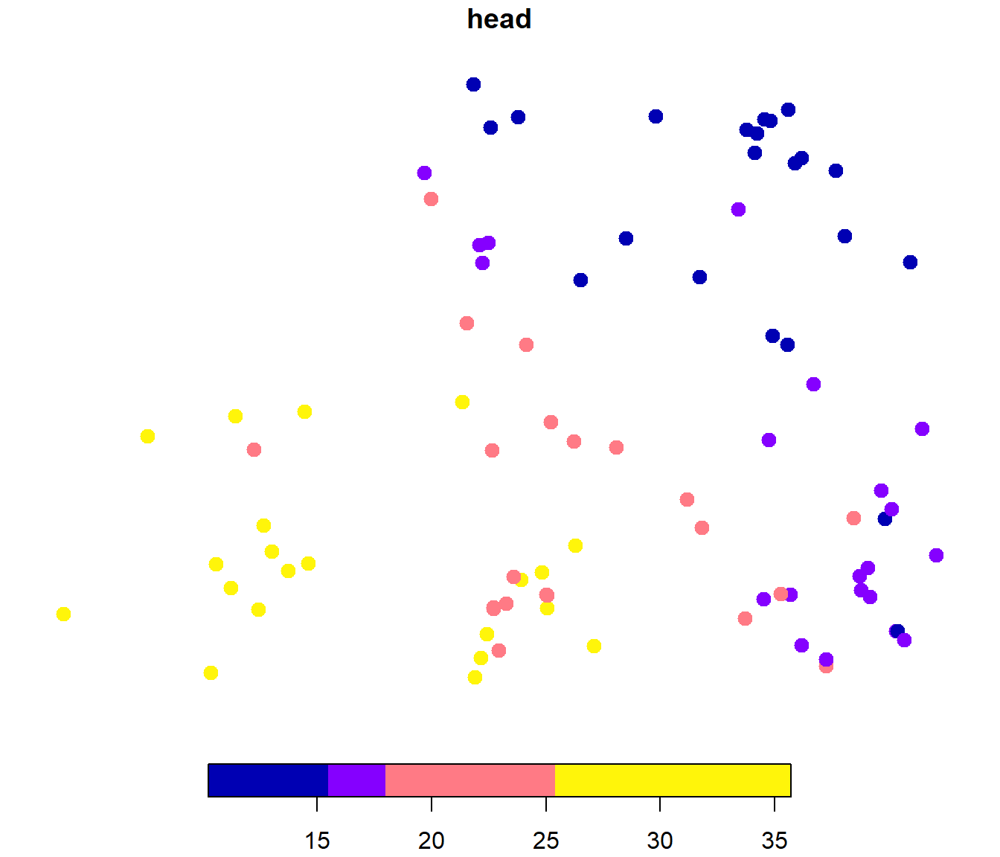
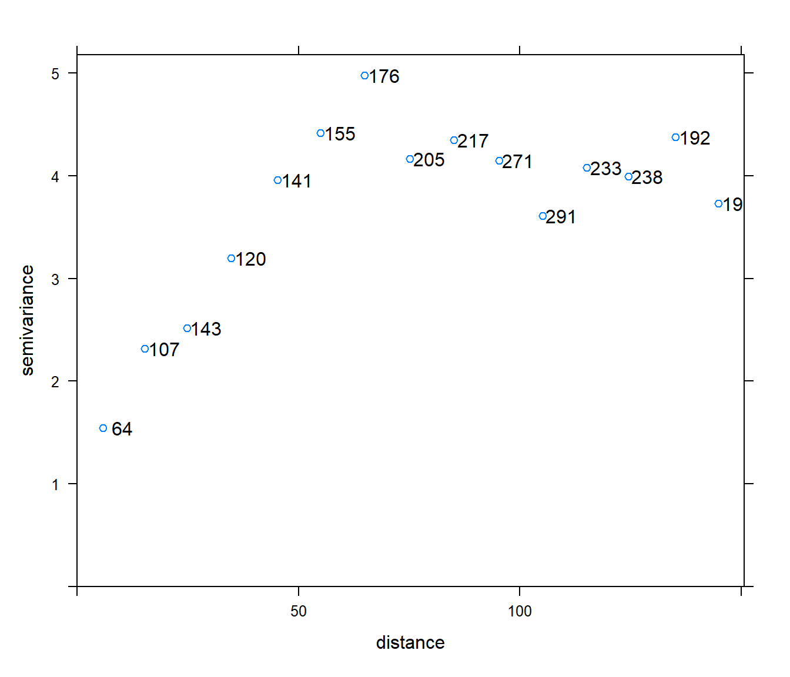
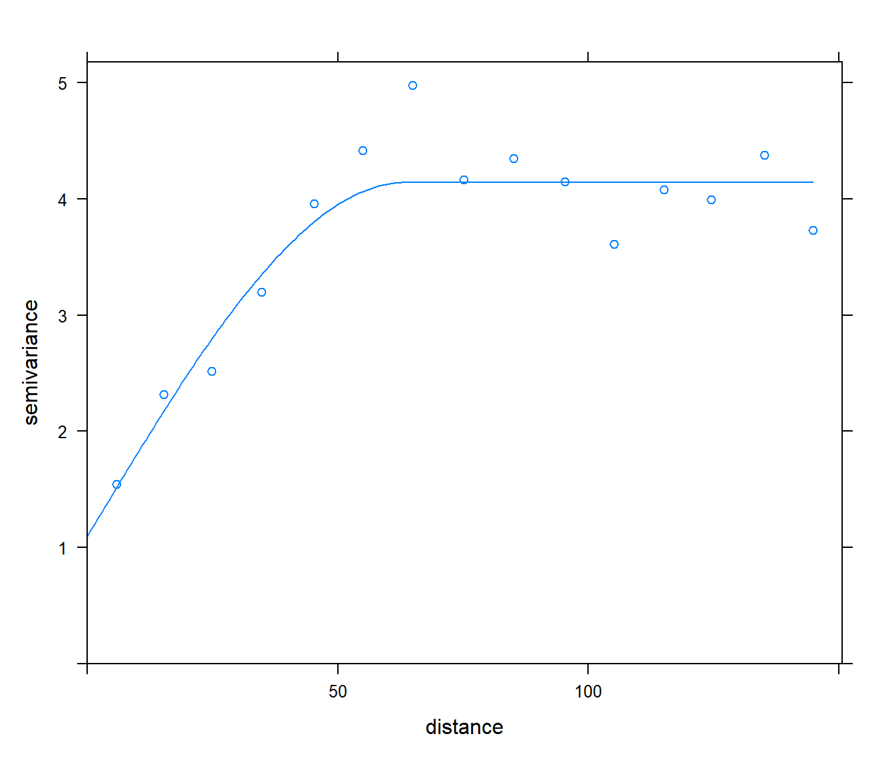

# Ejemplo de análisis geoestadístico {#ejemplo-aquifer}

<!--
---
title: "Ejemplo de análisis geoestadístico"
author: "Estadística Espacial"
date: "Análisis estadístico de datos con dependencia (GCED, GCED, UDC)"
output: 
  bookdown::html_document2:
    pandoc_args: ["--number-offset", "0,0"]
    toc: yes 
    # mathjax: local            # copia local de MathJax, hay que establecer:
    # self_contained: false     # las dependencias se guardan en ficheros externos 
  bookdown::pdf_document2:
    keep_tex: yes
    toc: yes 
---

Apéndice \@ref(ejemplo-aquifer)
bookdown::preview_chapter("14-ejemplo_aquifer.Rmd")
knitr::purl("14-ejemplo_aquifer.Rmd", documentation = 2)
knitr::spin("14-ejemplo_aquifer.R",knit = FALSE)
-->


El objetivo es realizar un análisis geoestadístico del conjunto de datos `aquifer` (considerando como variable de interés `aquifer$head` y asumiendo la presencia de una tendencia espacial lineal), siguiendo el procedimiento descrito en la Sección \@ref(objetivos-esquema) (y en la introducción del Capítulo \@ref(modelado)).


## Carga de datos y creación del objeto `sf`:

En este caso, cómo es habitual, los datos están almacenados en un `data.frame` y la recomendación es emplear `st_as_sf()` para convertirlos a un objeto `sf` (Sección \@ref(sf-intro)):


```r
load("datos/aquifer.RData")
library(sf)
aquifer$head <- aquifer$head/100 # en cientos de pies (escala más manejable...)
aquifer_sf <- st_as_sf(aquifer, coords = c("lon", "lat"), remove = FALSE, agr = "constant")
```

Por comodidad se establece `remove = FALSE` para mantener las coordenadas como posibles variables explicativas (el objeto con las observaciones debe contener todas las variables explicativas incluidas en el modelo de tendencia; también el objeto con las posiciones de predicción).

En caso necesario también habría que establecer el CRS (Sección \@ref(crs)) e incluso podría ser necesario transformar los datos a coordenadas proyectadas mediante `st_transform()`(Sección \@ref(operaciones-geometrias)).


## Análisis exploratorio

El primer paso es comenzar por un análisis exploratorio de los datos (Sección \@ref(sp-eda)).
Nos centraremos en el modelado de los datos, pero seguramente interesaría analizar si hay datos atípicos...

Estaríamos interesados en la simetría y normalidad de la respuesta (o del error). 
Podríamos empezar por realizar un análisis descriptivo unidimensional:


```r
z <- aquifer_sf$head
summary(z)
```

```
##    Min. 1st Qu.  Median    Mean 3rd Qu.    Max. 
##   10.24   15.48   17.97   20.02   25.40   35.71
```

```r
hist(z, xlab = "piezometric-head", main = "", freq = FALSE)
lines(density(z), col = 'blue')
```


Nos interesaría estudiar si la media es constante o hay una tendencia espacial (analizar la variabilidad de gran escala).
Podríamos analizar la distribución espacial de los datos:


```r
plot(aquifer_sf["head"], pch = 20, cex = 2, breaks = "quantile", nbreaks = 4)
```



y generar gráficos de dispersión de la respuesta frente a coordenadas (o frente a otras posibles variables explicativas):


```r
x <- aquifer_sf$lon
y <- aquifer_sf$lat
old.par <- par(mfrow = c(1, 2), omd = c(0.05, 0.95, 0.01, 0.95))
plot(x, z)
lines(lowess(x, z), lty = 2, lwd = 2, col = 'blue')
plot(y, z)
lines(lowess(y, z), lty = 2, lwd = 2, col = 'blue')
```


```r
par(old.par)
```

Como resultado de este análisis se propondría un modelo inicial para la tendencia
(incluyendo el caso de media constante, de la forma `respuesta ~ 1`, que se correspondería con el kriging ordinario).
En este caso parece razonable considerar (como punto de partida) un modelo lineal `head ~ lon + lat` para la tendencia (modelo del kriging universal).

Podríamos empezar por ajustar el modelo por OLS (cuidado con los resultados de inferencia, ya que en principio no sería razonable asumir que las observaciones son independientes y por ejemplo la varianza estaría subestimada) y analizar los residuos...


```r
trend.ols <- lm(head ~ lon + lat, data = aquifer_sf)
summary(trend.ols)
```

```
## 
## Call:
## lm(formula = head ~ lon + lat, data = aquifer_sf)
## 
## Residuals:
##     Min      1Q  Median      3Q     Max 
## -3.6700 -1.6141 -0.3074  1.4823  6.5117 
## 
## Coefficients:
##              Estimate Std. Error t value Pr(>|t|)    
## (Intercept) 25.913266   0.389636   66.51   <2e-16 ***
## lon         -0.067519   0.003439  -19.64   <2e-16 ***
## lat         -0.059862   0.004066  -14.72   <2e-16 ***
## ---
## Signif. codes:  0 '***' 0.001 '**' 0.01 '*' 0.05 '.' 0.1 ' ' 1
## 
## Residual standard error: 2.033 on 82 degrees of freedom
## Multiple R-squared:  0.892,	Adjusted R-squared:  0.8894 
## F-statistic: 338.8 on 2 and 82 DF,  p-value: < 2.2e-16
```

```r
z <- residuals(trend.ols)
summary(z)
```

```
##    Min. 1st Qu.  Median    Mean 3rd Qu.    Max. 
## -3.6700 -1.6141 -0.3074  0.0000  1.4823  6.5117
```

```r
hist(z, xlab = "ols residuals", main = "", freq = FALSE)
lines(density(z), col = 'blue')
```


El análisis de la variabilidad de pequeña escala se realizaría a través de las semivarianzas (clásicas o robustas, Sección \@ref(vario-muestrales)), pero solo consideraremos los estimadores muestrales, para el modelado de la dependencia espacial.


## Modelado de la dependencia

### Estimación experimental del variograma

Como se muestra en la Sección \@ref(vario-muestrales), las estimaciones empíricas del semivariograma se obtienen con la función [`variogram()`](https://r-spatial.github.io/gstat/reference/variogram.html).

En el caso de tendencia no constante la estimación del variograma se haría a partir de los residuos, Sección \@ref(trend-fit), especificando la fórmula del modelo de tendencia como primer argumento de la función `variogram()` (si la tendencia es constante, la fórmula sería del tipo `respuesta ~ 1`, y la estimación del variograma se obtendría directamente de las observaciones).


```r
library(gstat)
# maxlag <- 0.5*sqrt(sum(diff(matrix(st_bbox(aquifer_sf), nrow = 2, byrow = TRUE))^2))
maxlag <- 150
vario <- variogram(head ~ lon + lat, aquifer_sf, cutoff = maxlag)
# por defecto considera 15 saltos (width = cutoff/15)
```

Habría que determinar el número de saltos (por defecto 15, `width = cutoff/15`) y el salto máximo (por defecto 1/3 del máximo salto posible) para la estimación del variograma (nos interesaría que fuese lo mejor posible cerca del origen).
Para seguir las recomendaciones de Journel y Huijbregts (1978), de considerar a lo sumo hasta la mitad del máximo salto posible (podría ser preferible menor) y saltos con aportaciones de al menos 30 pares de datos (se puede relajar cerca del origen), podemos representar las estimaciones junto con el número de aportaciones:


```r
plot(vario, plot.numbers = TRUE)
```



Si hay datos atípicos sería preferible emplear una versión robusta de este estimador.
Además, estamos asumiendo isotropía, aunque lo ideal sería asegurarse de que es una hipótesis razonable (ver comentarios al final de la Sección \@ref(vario-muestrales) y Sección \@ref(anisotropia)).

### Ajuste de un modelo válido

El paso final en el modelado es el ajuste por WLS de un modelo válido (Sección \@ref(ls-fit); la recomendación es emplear pesos inversamente proporcionales a la varianza `fit.method = 2`).
En este caso un modelo de variograma esférico parece razonable:


```r
modelo <- vgm(model = "Sph", nugget = NA) # Valores iniciales por defecto
# modelo <- vgm(psill = 3, model = "Sph", range = 75, nugget = 0) # Valores iniciales
fit <- fit.variogram(vario, modelo, fit.method = 2)
```

NOTA: Si aparecen problemas de convergencia se puede probar a cambiar los valores iniciales de los parámetros.

Imprimiendo el resultado del ajuste obtenemos las estimaciones de los parámetros, que podríamos interpretar (ver Sección \@ref(procesos-estacionarios) y Sección \@ref(efecto-variog-kriging)):


```r
fit
```

```
##   model    psill    range
## 1   Nug 1.095133  0.00000
## 2   Sph 3.044034 63.39438
```

```r
nugget <- fit$psill[1]
sill <- nugget + fit$psill[2]
range <- fit$range[2]
```

NOTA: Cuidado, en el caso de un variograma exponencial, el parámetro que aparece como `range` es un parámetro de escala proporcional al verdadero rango práctico (tres veces ese valor).

Si quisiésemos comparar el ajuste de distintos modelos se podría considerar el valor mínimo de la función objetivo WLS, almacenado como un atributo del resultado (aunque la recomendación sería emplear validación cruzada):


```r
attr(fit, "SSErr")
```

```
## [1] 8.424426
```

En cualquier caso la recomendación es analizar gráficamente el ajuste de los modelos.
Para representar las estimaciones empíricas junto con un único ajuste, se
podría emplear `plot.gstatVariogram()`:


```r
# Cuidado con plot.variogramModel() si se pretende añadir elementos
# plot(fit, cutoff = maxlag, ylim = c(0, 4.5))
# with(vario,  points(dist, gamma))
plot(vario, fit)
```



Para añadir más elementos mejor hacerlo "a mano":


```r
plot(vario$dist, vario$gamma, xlab = "distance", ylab =  "semivariance", 
     xlim = c(0, max(range*1.1, maxlag)), ylim = c(0, sill*1.1))
lines(variogramLine(fit, maxdist = max(range*1.1, maxlag)))
abline(v = 0, lty = 3)
abline(v = range, lty = 3)
abline(h = nugget, lty = 3)
abline(h = sill, lty = 3)
```


## Predicción espacial (KU)

Para generar la rejilla de predicción consideramos un buffer de radio 40 en torno a las posiciones espaciales:


```r
buffer <- aquifer_sf %>% st_geometry() %>% st_buffer(40)
```

En lugar de emplear una rejilla `sf`:


```r
# grid <- buffer %>% st_make_grid(n = c(50, 50), what = "centers") %>% st_intersection(buffer)
```

por comodidad es preferible emplear una rejilla `stars`:


```r
library(stars)
grid <- buffer %>%  st_as_stars(nx = 50, ny = 50)
```

Si suponemos un modelo (no constante) para la tendencia, es necesario añadir los valores de las variables explicativas a la rejilla de predicción:


```r
coord <- st_coordinates(grid)
grid$lon <- coord$x
grid$lat <- coord$y
```

Además, en este caso recortamos la rejilla para filtrar predicciones alejadas de las observaciones:


```r
grid <- grid %>% st_crop(buffer)
```

Obtenemos las predicciones mediante kriging universal (Sección \@ref(kuniversal) y Sección \@ref(kriging-gstat)):


```r
pred <- krige(formula = head ~ lon + lat, locations = aquifer_sf, model = fit,
              newdata = grid)
```

```
## [using universal kriging]
```


***ERROR en krige***: cambia las coordenadas del objeto stars


```r
summary(st_coordinates(grid))
```

```
##        x                 y         
##  Min.   :-181.86   Min.   :-28.03  
##  1st Qu.:-100.73   1st Qu.: 33.25  
##  Median : -16.22   Median : 97.09  
##  Mean   : -16.22   Mean   : 97.09  
##  3rd Qu.:  68.29   3rd Qu.:160.93  
##  Max.   : 149.42   Max.   :222.21
```

```r
summary(st_coordinates(pred))
```

```
##        x                 y         
##  Min.   :-181.86   Min.   : 53.83  
##  1st Qu.:-100.73   1st Qu.:115.11  
##  Median : -16.22   Median :178.95  
##  Mean   : -16.22   Mean   :178.95  
##  3rd Qu.:  68.29   3rd Qu.:242.79  
##  Max.   : 149.42   Max.   :304.08
```

Posible solución: añadir el resultado a `grid`:


```r
grid$var1.pred <- pred$var1.pred
grid$var1.var <- pred$var1.var
```

Finalmente representamos las predicciones y las varianzas kriging:


```r
plot(grid["var1.pred"], breaks = "equal", col = sf.colors(64), key.pos = 4,
     main = "Predicciones kriging")
```


```r
plot(grid["var1.var"], breaks = "equal", col = sf.colors(64), key.pos = 4,
     main = "Varianzas kriging")
```


También podríamos emplear el paquete `ggplot2`:


```r
library(ggplot2)
library(gridExtra)
p1 <- ggplot() + geom_stars(data = grid, aes(fill = var1.pred, x = x, y = y)) +
    scale_fill_viridis_c() + geom_sf(data = aquifer_sf) +
    coord_sf(lims_method = "geometry_bbox")
p2 <- ggplot() + geom_stars(data = grid, aes(fill = var1.var, x = x, y = y)) +
    scale_fill_viridis_c() + geom_sf(data = aquifer_sf) +
    coord_sf(lims_method = "geometry_bbox")
grid.arrange(p1, p2, ncol = 2)
```


## Validación cruzada

Para realizar una diagnosis del modelo de tendencia y variograma (y para seleccionar parámetros o comparar modelos) podemos emplear la técnica de validación cruzada Sección \@ref(validacion-cruzada), mediante la función `krige.cv()`.

Por defecto emplea LOOCV y puede requerir de mucho tiempo de computación (no está implementado eficientemente en `gtsat`):


```r
system.time(cv <- krige.cv(formula = head ~ lon + lat, locations = aquifer_sf,
                           model = fit))
```

```
##    user  system elapsed 
##    0.56    0.02    0.58
```

```r
str(cv)
```

```
## Classes 'sf' and 'data.frame':	85 obs. of  7 variables:
##  $ var1.pred: num  15 23.5 22.9 24.6 17 ...
##  $ var1.var : num  3.08 2.85 2.32 2.81 2.05 ...
##  $ observed : num  14.6 25.5 21.6 24.6 17.6 ...
##  $ residual : num  -0.3357 1.9962 -1.3101 -0.0792 0.5478 ...
##  $ zscore   : num  -0.1914 1.1821 -0.8608 -0.0472 0.3829 ...
##  $ fold     : int  1 2 3 4 5 6 7 8 9 10 ...
##  $ geometry :sfc_POINT of length 85; first list element:  'XY' num  42.8 127.6
##  - attr(*, "sf_column")= chr "geometry"
##  - attr(*, "agr")= Factor w/ 3 levels "constant","aggregate",..: NA NA NA NA NA NA
##   ..- attr(*, "names")= chr [1:6] "var1.pred" "var1.var" "observed" "residual" ...
```

Si el número de observaciones es grande puede ser preferible emplear k-fold CV (y como la partición en grupos es aleatoria se recomendaría fijar previamente la semilla de aleatorización):


```r
set.seed(1)
system.time(cv <- krige.cv(formula = head ~ lon + lat, locations = aquifer_sf,
                           model = fit, nfold = 10))
```

```
##    user  system elapsed 
##    0.14    0.02    0.16
```

Para seleccionar modelos podemos considerar distintas medidas, implementadas en la siguiente función:


```r
summary_cv <- function(cv.data, na.rm = FALSE,
                       tol = sqrt(.Machine$double.eps)) {
  err <- cv.data$residual      # Errores
  obs <- cv.data$observed
  z <- cv.data$zscore
  w <- 1/pmax(cv.data$var1.var, tol) # Ponderación según varianza kriging
  if(na.rm) {
    is.a <- !is.na(err)
    err <- err[is.a]
    obs <- obs[is.a]
    z <- z[is.a]
    w <- w[is.a]
  }
  perr <- 100*err/pmax(obs, tol)  # Errores porcentuales
  return(c(
    # Medidas de error tradicionales
    me = mean(err),           # Error medio
    rmse = sqrt(mean(err^2)), # Raíz del error cuadrático medio
    mae = mean(abs(err)),     # Error absoluto medio
    mpe = mean(perr),         # Error porcentual medio
    mape = mean(abs(perr)),   # Error porcentual absoluto medio
    r.squared = 1 - sum(err^2)/sum((obs - mean(obs))^2), # Pseudo R-cuadrado
    # Medidas de error que tienen en cuenta la varianza kriging
    dme = mean(z),            # Error estandarizado medio
    dmse = sqrt(mean(z^2)),    # Error cuadrático medio adimensional
    rwmse = sqrt(weighted.mean(err^2, w)) # Raíz del ECM ponderado
  ))
}

summary_cv(cv)
```

```
##           me         rmse          mae          mpe         mape    r.squared 
##  0.058039856  1.788446500  1.407874022 -0.615720059  7.852363328  0.913398424 
##          dme         dmse        rwmse 
##  0.001337332  1.118978878  1.665958815
```

Las tres últimas medidas tienen en cuenta la estimación de la varianza kriging. 
El valor del error cuadrático medio adimensional debería ser próximo a 1 si hay concordancia entre las varianzas kriging y las varianzas observadas.

Para detectar datos atípicos, o problemas con el modelo, podemos generar distintos gráficos.
Por ejemplo, gráficos de dispersión de valores observados o residuos estándarizados frente a predicciones:


```r
old_par <- par(mfrow = c(1, 2))
plot(observed ~ var1.pred, data = cv, xlab = "Predicción", ylab = "Observado")
abline(a = 0, b = 1, col = "blue")

plot(zscore ~ var1.pred, data = cv, xlab = "Predicción", ylab = "Residuo estandarizado")
abline(h = c(-3, -2, 0, 2, 3), lty = 3)
```


```r
par(old_par)
```

Gráficos con la distribución espacial de los residuos:


```r
plot(cv["residual"], pch = 20, cex = 2, breaks = "quantile", nbreaks = 4)
```


```r
plot(cv["zscore"], pch = 20, cex = 2)
```


Además de los gráficos estándar para analizar la distribución de los residuos estandarizados o detectar atípicos:


```r
# Histograma
old_par <- par(mfrow = c(1, 3))
hist(cv$zscore, freq = FALSE)
lines(density(cv$zscore), col = "blue")
# Gráfico de normalidad
qqnorm(cv$zscore)
qqline(cv$zscore, col = "blue")
# Boxplot
car::Boxplot(cv$zscore, ylab = "Residuos estandarizados")
```


```
## [1] 78
```

```r
par(old_par)
```


